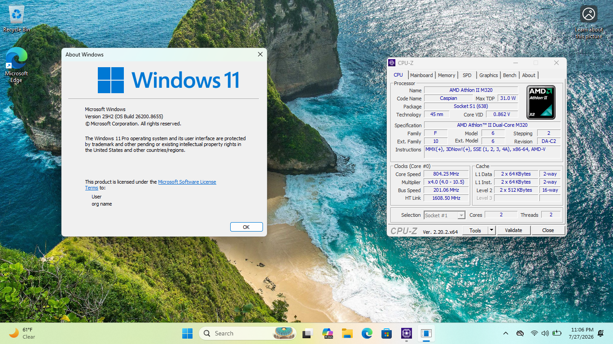

# POP4.2
This is an experimental patcher that allows CPUs *with* POPCNT, but *without* SSE4.2 (such as the AMD Phenom and K10 lines of CPUs) to boot Windows 11 24H2 and beyond. It has been tested on Windows 11 25H2 v2. Other builds have not been tested, but should work.

## What? Windows 11 needs that. This is impossible!
Yes and no. While Windows 11 checks for *both* POPCNT and SSE4.2, it does not actually need SSE4.2 for 99% of its files, with only a singular exception that can be worked around (read on). To enforce this, Microsoft uses the undocumented `RtlDetectProcessorFeatures` function and checks for requirements by reading data from `.rdata`. In kernel 26100.7171, this is at offset `00000001400088C0` and has the bytes `01 00 00 00 00 00 00 00 00 00 10 00 02 00 00 00 0D 00 00 00` in IDA. To defeat this, we simply flip that `0D` to a `0C`, telling Windows to effectively skip the check and continue booting.

## Prerequisites
- Windows 8 or newer
- Python 3.9+ with `pefile`:
  ```bash
  pip install pefile
  ```
- Windows ADK (Deployment Tools) for `oscdimg.exe`. It will be automatically downloaded if missing.
- A copy of `WindowsCodecs.dll` (64-bit) extracted from Windows 11 23H2 placed into the `blobs/` directory (see *"Why WindowsCodecs.dll?"* below).

## Usage

### 1. Build a Full Patched ISO (Recommended)
You can build a bootable dual-boot (UEFI + BIOS) patched ISO from your original Windows 11 ISO with a single command:
```bash
python pop42.py build -i Win11_24H2_English_x64.iso -o Win11_Patched.iso --clean --index <index_number>
```
> [!NOTE]
> This command will automatically request Administrator elevation to manage WIM mounts and offline registry hives.

### 2. Standalone Binary Patching
If you only need to patch individual binaries directly (e.g. for testing or Windows PE):
* **Patch the NT Kernel (`ntoskrnl.exe`):**
  ```bash
  python pop42.py patch kernel_sse42 -i path\to\ntoskrnl.exe -o path\to\ntoskrnl_patched.exe
  ```
* **Patch the Boot Loader (`winload.efi` / `winload.exe`):**
  ```bash
  python pop42.py patch winload -i path\to\winload.exe -o path\to\winload_patched.exe
  ```
* **Patch the Provisioning Tool (`provtool.exe`):**
  ```bash
  python pop42.py patch provtool_exit -i path\to\provtool.exe -o path\to\provtool_patched.exe
  ```
> [!NOTE]
> If `-o` is omitted, the input file will be modified and overwritten in-place.

### 3. Legacy C Patcher
> [!IMPORTANT]
> This patcher is deprecated. You probably want to use the Nuitka-compiled Python script instead.

This can be found in the `patcher_legacy` folder of this repository. It's a standard Win32 app that should execute
on basically anything that can run a Win32 executable.

---

## Why WindowsCodecs.dll?
For some reason, Microsoft compiled this specific DLL with SSE4.1 instructions (`PMOVSXBW`). If you do not replace it, Windows Setup will crash and restart when attempting to execute it. Even if you deploy the WIM manually, Windows will later enter Automatic Recovery since it tries to execute setup.exe again to finish installing. For these reasons, replacing this file with the 23H2 version in `blobs/` is required.

## Customizing Blobs (`badblobs.xml`)
POP4.2 tracks problematic binaries using `badblobs.xml`. Each entry defines target paths and actions (`patch`, `replace`, `ignore`). You can customize or add replacement blobs by editing `badblobs.xml`.

---

## Known issues
- Certain Nvidia nForce chipsets hang on boot. Needs further investigation.
- Intel Core 2 CPUs are not currently supported. These lack POPCNT, which *is* used heavily.
- This whole thing is experimental. Please file any bugs or quirks you find in the Issues tab.

## Screenshot



## Credits
- Bob Pony, for letting me test on his machine.
- QEMU, for making a great emulator and debugger.
- Google, for making Gemini, a great model that helped me figure this out.
- IDA, for their invaluable disassembler.
- Microsoft, for Windows 11.

## License
This program, its accompanying files, and all files otherwise included in this repository are licensed under the MIT License. Consult the [LICENSE](LICENSE) file for details.
